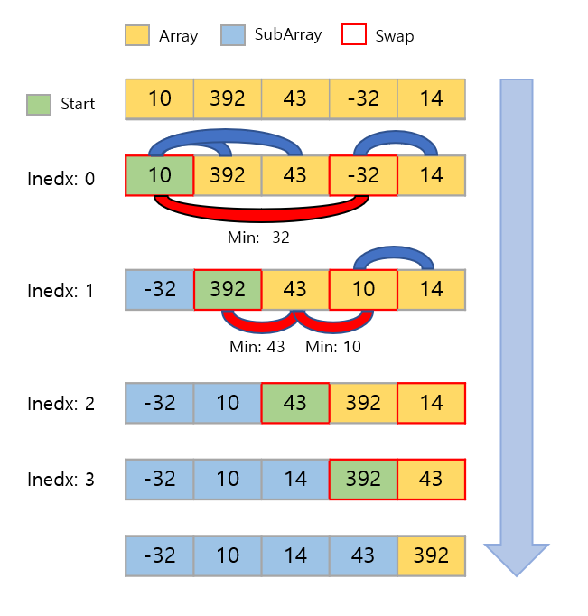

# Array

Array는 연속된 메모리 위치에 저장돼 있는 Element의 Collection이다.

## Sort

아래 나와있는 모든 Sort 방식은 Ascending Order만 고려했다.

### Selection Sorting

Selection Sorting은 정렬하고자 하는 Array와 Array내에서 SubArray라는 가상의 영역을 둬 Array내에서 가장 작은 값을 SubArray에 연속으로 배치하는 형식의 Sorting이다.

[코드](https://github.com/lumyjuwon/ComputerScience/blob/master/DataStructure/Linear/Array/SelectionSort.cpp)

### Insert Sorting

### Bubble Sorting

### Merge Sorting

### Quick Sorting

### Alternative Sorting

Alternative Sorting은 Array의 첫 번째 짝수번 Index가 Array의 Element들 중 첫 번째로 가장 커야 하며 첫 번째 홀수번 Index가 Array의 Element들 중 첫 번째로 가장 작은 Element으로 정렬하는 기법이다.

## Search

## Insert

## Delete
